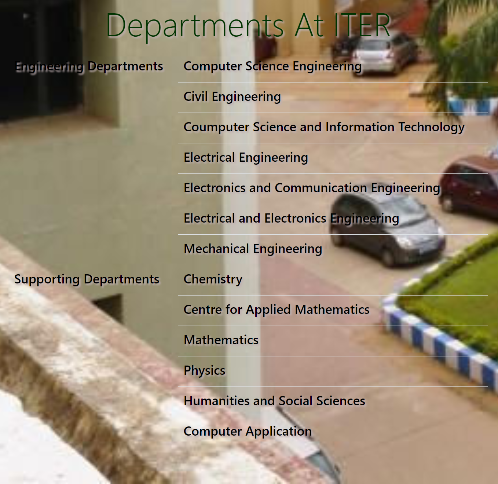

# The website is showcasing the visionaries, courses, departments and other basic features of a college. 

[Visit this website](https://iter-college.netlify.app/index.html)

# Screenshots

<b>Home page</b>

<b>Courses Offered</b>

<b>Departments</b>

<b>Notice Board</b>

<b>Contact form</b>

